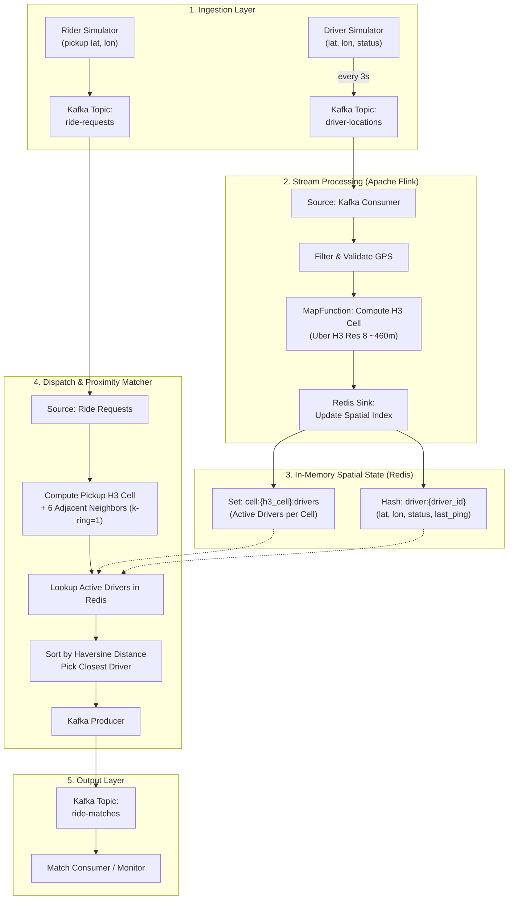

# Real-Time Ride-Hailing System: Implementation Plan

> **Scope**: Focused strictly on **Driver Location Ping** and **User Ride Request** matching.
> **Tech Stack**: Apache Kafka, Apache Flink (Java 17/21+), Redis (Spatial State), Uber H3, Docker Compose.

---

## 1. System Architecture

---
