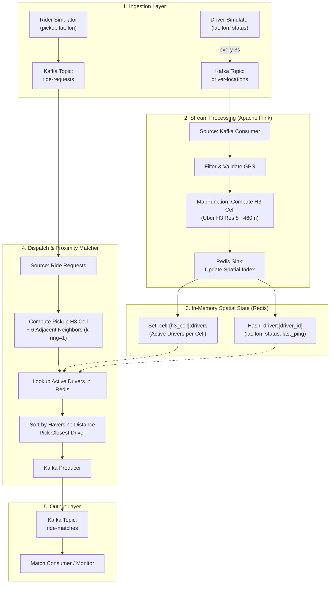

# Real-Time Ride-Hailing System: Implementation Plan

> **Scope**: Focused strictly on **Driver Location Ping** and **User Ride Request** matching.
> **Tech Stack**: Apache Kafka, Apache Flink (Java 17/21+), Redis (Spatial State), Uber H3, Docker Compose.

---

## 1. System Architecture



---

## 2. Component Specifications & Schemas

### A. Data Models (Java POJOs / JSON)

1. **`DriverLocationPing`**
   ```json
   {
     "driverId": "driver_101",
     "latitude": 37.7749,
     "longitude": -122.4194,
     "status": "AVAILABLE",
     "bearing": 90.0,
     "timestamp": 1718000000000
   }
   ```

2. **`RideRequest`**
   ```json
   {
     "requestId": "req_501",
     "riderId": "rider_201",
     "pickupLat": 37.7752,
     "pickupLon": -122.4180,
     "timestamp": 1718000005000
   }
   ```

3. **`RideMatch`**
   ```json
   {
     "requestId": "req_501",
     "riderId": "rider_201",
     "driverId": "driver_101",
     "driverLat": 37.7749,
     "driverLon": -122.4194,
     "pickupLat": 37.7752,
     "pickupLon": -122.4180,
     "distanceMeters": 126.5,
     "status": "OFFERED",
