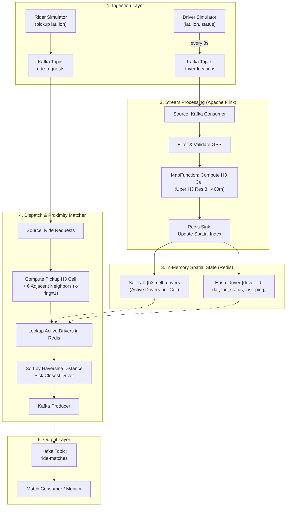

# Real-Time Ride-Hailing System: Implementation Plan

> **Scope**: Focused strictly on **Driver Location Ping** and **User Ride Request** matching.
> **Tech Stack**: Apache Kafka, Apache Flink (Java 17/21+), Redis (Spatial State), Uber H3, Docker Compose.

---

## 1. System Architecture



---

## 2. Component Specifications & Schemas

### A. Data Models (Java POJOs / JSON)

1. **`DriverLocationPing`**
   ```json
   {
     "driverId": "driver_101",
     "latitude": 37.7749,
     "longitude": -122.4194,
     "status": "AVAILABLE",
     "bearing": 90.0,
     "timestamp": 1718000000000
   }
   ```

2. **`RideRequest`**
   ```json
   {
     "requestId": "req_501",
     "riderId": "rider_201",
     "pickupLat": 37.7752,
     "pickupLon": -122.4180,
     "timestamp": 1718000005000
   }
   ```

3. **`RideMatch`**
   ```json
   {
     "requestId": "req_501",
     "riderId": "rider_201",
     "driverId": "driver_101",
     "driverLat": 37.7749,
     "driverLon": -122.4194,
     "pickupLat": 37.7752,
     "pickupLon": -122.4180,
     "distanceMeters": 126.5,
     "status": "OFFERED",
     "matchedAt": 1718000005120
   }
   ```

### B. Redis Spatial Key Layout
* `cell:<h3_cell_hex>:drivers` $\to$ **Set** of `driver_id`s currently residing in that hexagon.
* `driver:<driver_id>` $\to$ **Hash** storing `{lat, lon, status, h3_cell, last_ping}` with a short TTL (e.g. 15s) for automatic eviction if pings stop.

---

## 3. Phased Implementation Roadmap

### Phase 1: Local Infrastructure Setup
- Create project directory: `ride-hailing-system/`
- Set up `docker-compose.yml`:
  - **Kafka** (KRaft mode, single-node, port 9092)
  - **Redis** (alpine, port 6379)
- Verify services health and create the required Kafka topics:
  - `driver-locations`
  - `ride-requests`
  - `ride-matches`

### Phase 2: Java Project Setup & Build Configuration
- Set up Maven or Gradle project structure:
  - Java 17/21 compatibility.
  - Dependencies:
    - `org.apache.flink:flink-streaming-java`
    - `org.apache.flink:flink-connector-kafka`
    - `com.uber:h3` (Uber H3 spatial indexing library)
    - `redis.clients:jedis` (Redis client)
    - `com.fasterxml.jackson.core:jackson-databind`
    - `org.slf4j:slf4j-simple`

### Phase 3: Flink Streaming Pipeline (`DriverLocationStreamJob`)
- Define POJOs and JSON serialization schemas.
- Implement Flink DAG:
  1. Read from Kafka topic `driver-locations`.
  2. Map function: Compute H3 index (resolution 8, $\approx 460\text{m}$ edge length).
  3. Sink function (`RedisSpatialSink`):
     - Remove driver from old H3 cell set (if cell changed).
     - Add driver to new H3 cell set.
     - Update `driver:<driverId>` hash with TTL.
- Test with sample driver pings and verify Redis state updates.

### Phase 4: Match / Dispatch Service (`RideMatchingService`)
- Read from Kafka topic `ride-requests`.
- Compute pickup H3 cell + 6 immediate neighbors (`h3.gridDisk(pickupCell, 1)`).
- Query Redis for active drivers across the 7 cells.
- Calculate exact Haversine distance between pickup location and each candidate driver.
- Select the nearest available driver, mark driver as reserved/offered, and publish match to `ride-matches`.

### Phase 5: End-to-End Simulation & Verification
- Build a Python/Java simulator script:
  - Generates 10–20 drivers moving within a localized area (e.g., Downtown San Francisco or Bengaluru).
  - Emits location pings every 3 seconds to Kafka.
  - Submits 1 or more ride requests to Kafka.
- Verify that:
  1. Flink processes pings with $<10\text{ms}$ latency.
  2. Redis spatial state correctly tracks real-time driver positions.
  3. The matching service picks the closest driver and outputs to `ride-matches`.
  4. Stale/offline drivers are excluded.

---

## 4. Next Steps & Iterations (Beyond V1)
1. **Surge Pricing Aggregations**: Flink sliding window counting supply vs. demand per H3 cell.
2. **Driver Acceptance State Machine**: 15s countdown for driver acceptance with automatic fallback to runner-up.
3. **Deadman Switch Timers in Flink**: Proactive emission of `DRIVER_OFFLINE` events if no ping arrives in 15 seconds.
